

| [](https://github.com/kichkiro?tab=repositories) | [](https://github.com/kichkiro?tab=repositories) |
|:-:|:-:|

--------------

### My Projects

<table>
  <tr>
    <td width="42%">
      
    </td>
    <td width="58%" valign="middle" align="left">
      <b><a href="https://github.com/kichkiro/tf-nsx_deploy">tf-nsx_deploy</a></b>  
      Terraform project for automated deployment of VMware NSX infrastructure, organized in sequential stages for a controlled and repeatable provisioning workflow.
    </td>
  </tr>
</table>

--------------

### <a href="https://github.com/kichkiro/42">42 Network</a>

#### <a href="https://github.com/kichkiro/42/tree/main/42cursus/Common-Core">Common Core</a>

<table>
  <tr>
    <td width="42%">
      
    </td>
    <td width="58%" valign="middle" align="left">
      <b><a href="https://github.com/kichkiro/libft">Libft</a></b>  
      Your very first project as a student at 42: recode a few functions of the C standard library, plus some utility functions you will reuse throughout the whole cursus.
    </td>
  </tr>
  <tr>
    <td width="42%">
      
    </td>
    <td width="58%" valign="middle" align="left">
      <b><a href="https://github.com/kichkiro/Born2beRoot">Born2beRoot</a></b>  
      An introduction to the wonderful world of virtualization.
    </td>
  </tr>
  <tr>
    <td width="42%">
      
    </td>
    <td width="58%" valign="middle" align="left">
      <b><a href="https://github.com/kichkiro/ft_printf">ft_printf</a></b>  
      Recode printf and learn what variadic functions are and how to implement them. Once validated, this function is reused in future projects.
    </td>
  </tr>
  <tr>
    <td width="42%">
      
    </td>
    <td width="58%" valign="middle" align="left">
      <b><a href="https://github.com/kichkiro/get_next_line">get_next_line</a></b>  
      Whether reading a file, stdin, or a network connection, you always need a way to read content line by line. An essential function for future projects.
    </td>
  </tr>
  <tr>
    <td width="42%">
      <a href="https://github.com/kichkiro/push_swap">
        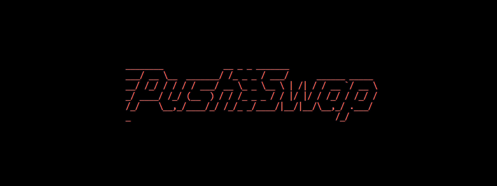
      </a>
    </td>
    <td width="58%" valign="middle" align="left">
      <b><a href="https://github.com/kichkiro/push_swap">push_swap</a></b>  
      Sort data on a stack with a limited set of instructions and the smallest number of moves, manipulating various sorting algorithms to find the most optimized solution.
    </td>
  </tr>
  <tr>
    <td width="42%">
      
    </td>
    <td width="58%" valign="middle" align="left">
      <b><a href="https://github.com/kichkiro/minitalk">minitalk</a></b>  
      A small data exchange program using UNIX signals. An introductory project for the bigger UNIX projects later in the cursus.
    </td>
  </tr>
  <tr>
    <td width="42%">
      <a href="https://github.com/kichkiro/FdF">
        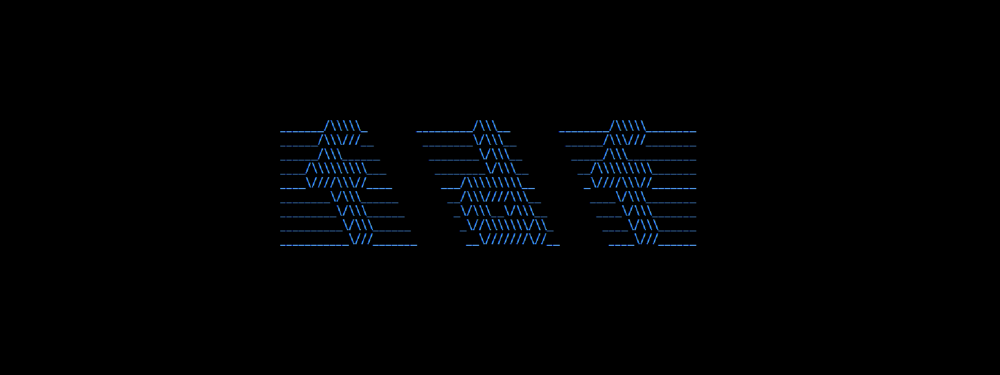
      </a>
    </td>
    <td width="58%" valign="middle" align="left">
      <b><a href="https://github.com/kichkiro/FdF">FdF</a></b>  
      A first step into graphic programming: open a graphics window and draw inside it, representing an "iron wire" meshing in 3D.
    </td>
  </tr>
  <tr>
    <td width="42%">
      <a href="https://github.com/kichkiro/Philosophers">
        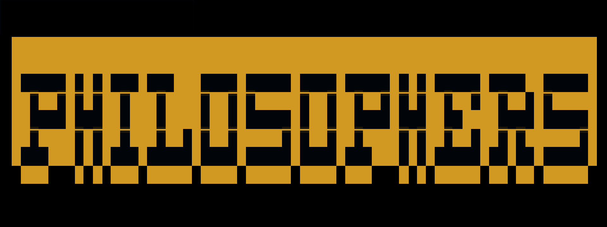
      </a>
    </td>
    <td width="58%" valign="middle" align="left">
      <b><a href="https://github.com/kichkiro/Philosophers">Philosophers</a></b>  
      Concurrent programming focused on multithreading and multiprocessing.
    </td>
  </tr>
  <tr>
    <td width="42%">
      <a href="https://github.com/kichkiro/minishell">
        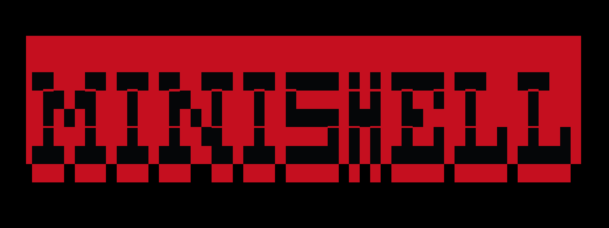
      </a>
    </td>
    <td width="58%" valign="middle" align="left">
      <b><a href="https://github.com/kichkiro/minishell">minishell</a></b>  
      Create a simple shell, as a small tribute to Bash.
    </td>
  </tr>
  <tr>
    <td width="42%">
      
    </td>
    <td width="58%" valign="middle" align="left">
      <b><a href="https://github.com/kichkiro/miniRT">miniRT</a></b>  
      An introduction to the beautiful world of Raytracing.
    </td>
  </tr>
  <tr>
    <td width="42%">
      
    </td>
    <td width="58%" valign="middle" align="left">
      <b><a href="https://github.com/kichkiro/NetPractice">NetPractice</a></b>  
      A general practical exercise to discover networking.
    </td>
  </tr>
  <tr>
    <td width="42%">
      <a href="https://github.com/kichkiro/CPP_Modules">
        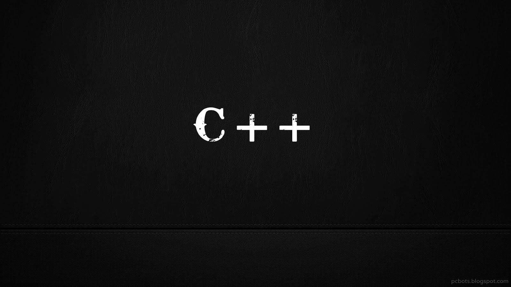
      </a>
    </td>
    <td width="58%" valign="middle" align="left">
      <b><a href="https://github.com/kichkiro/CPP_Modules">CPP_Modules</a></b>  
      A set of modules introducing Object-Oriented Programming in C++.
    </td>
  </tr>
  <tr>
    <td width="42%">
      
    </td>
    <td width="58%" valign="middle" align="left">
      <b><a href="https://github.com/kichkiro/Inception">Inception</a></b>  
      Broaden your system administration knowledge using Docker: virtualize several Docker images inside a personal virtual machine.
    </td>
  </tr>
  <tr>
    <td width="42%">
      <a href="https://github.com/kichkiro/webserv">
        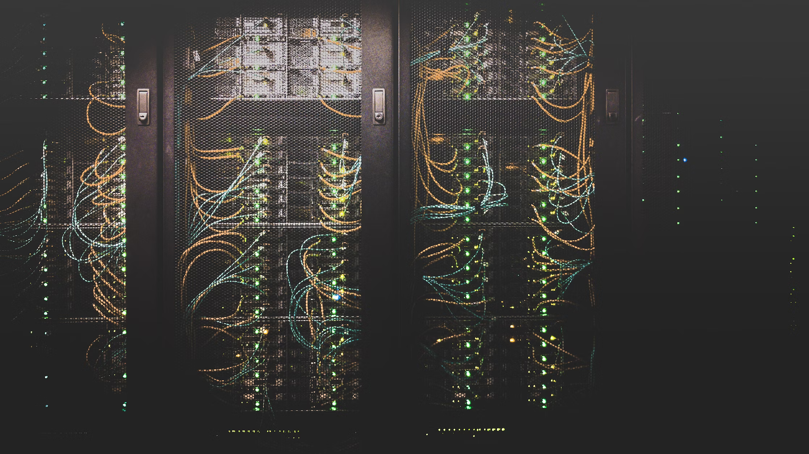
      </a>
    </td>
    <td width="58%" valign="middle" align="left">
      <b><a href="https://github.com/kichkiro/webserv">webserv</a></b>  
      Write your own HTTP server and test it with a real browser, diving into one of the most used protocols on the internet.
    </td>
  </tr>
  <tr>
    <td width="42%">
      
    </td>
    <td width="58%" valign="middle" align="left">
      <b><a href="https://github.com/kichkiro/ft_transcendence">ft_transcendence</a></b>  
      Design, development and organization of a full-stack web application.
    </td>
  </tr>
</table>

#### <a href="https://github.com/kichkiro/42/tree/main/42cursus/Advanced">Advanced</a>

<table>
  <tr>
    <td width="42%">
      <a href="https://github.com/kichkiro/ft_ping">
        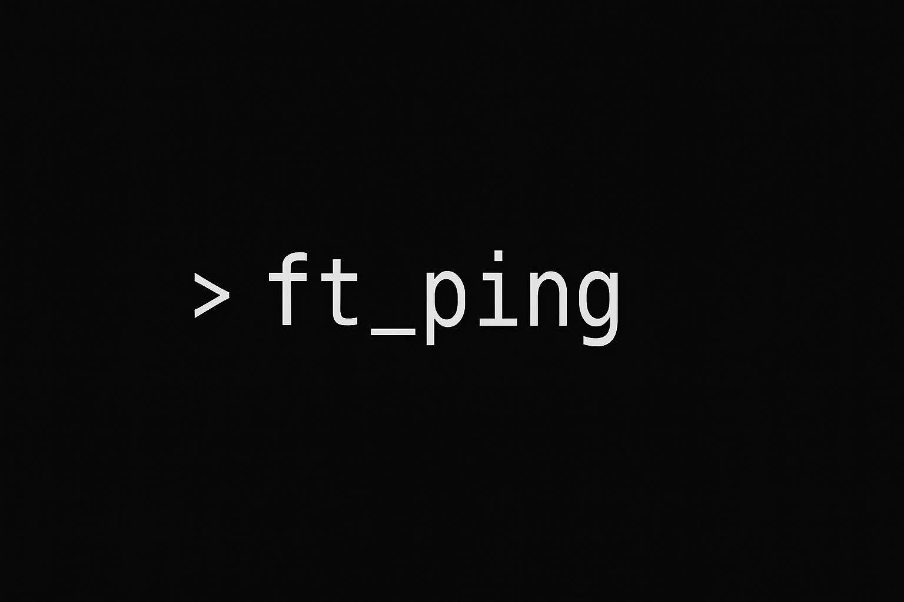
      </a>
    </td>
    <td width="58%" valign="middle" align="left">
      <b><a href="https://github.com/kichkiro/ft_ping">ft_ping</a></b>  
      Re-code the ping command to get acquainted with TCP/IP communication between two machines on a network.
    </td>
  </tr>
</table>

#### <a href="https://github.com/kichkiro/42/tree/main/piscines">Piscines</a>

<table>
  <tr>
    <td width="42%">
      
    </td>
    <td width="58%" valign="middle" align="left">
      <b><a href="https://github.com/kichkiro/42/tree/main/piscines/c_piscine">c_piscine</a></b>  
      Intensive C programming bootcamp: daily exercises building the fundamentals of the language.
    </td>
  </tr>
  <tr>
    <td width="42%">
      
    </td>
    <td width="58%" valign="middle" align="left">
      <b><a href="https://github.com/kichkiro/42/tree/main/piscines/discovery_piscine">discovery_piscine</a></b>  
      Introductory exercises to get familiar with the 42 environment and methodology.
    </td>
  </tr>
</table>

#### <a href="https://github.com/kichkiro/42/tree/main/testers">Testers</a>

<table>
  <tr>
    <td width="42%">
      <a href="https://github.com/kichkiro/philosophers_tester">
        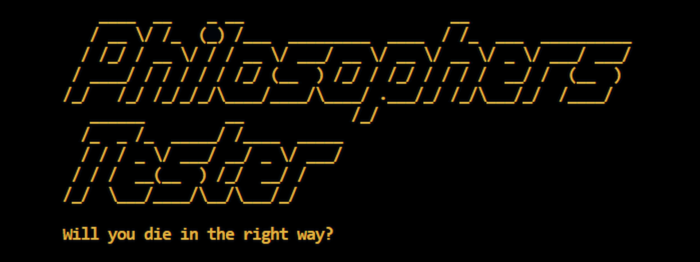
      </a>
    </td>
    <td width="58%" valign="middle" align="left">
      <b><a href="https://github.com/kichkiro/philosophers_tester">philosophers_tester</a></b>  
      Tester for the Philosophers project of school 42.
    </td>
  </tr>
  <tr>
    <td width="42%">
      <a href="https://github.com/kichkiro/minishell_tester">
        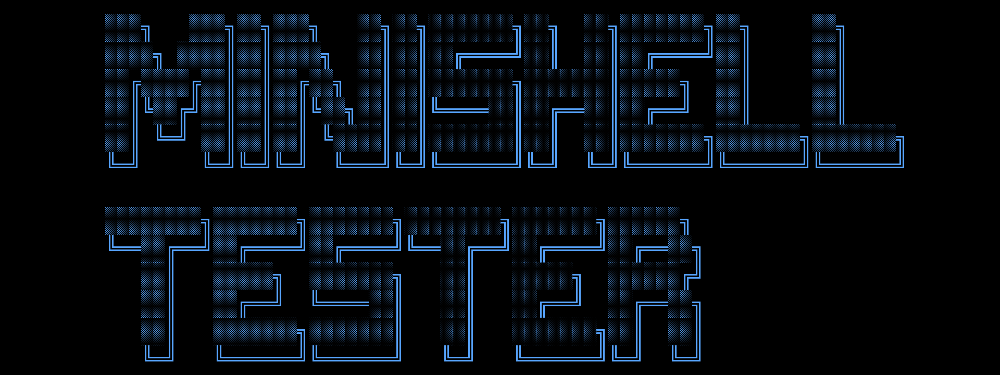
      </a>
    </td>
    <td width="58%" valign="middle" align="left">
      <b><a href="https://github.com/kichkiro/minishell_tester">minishell_tester</a></b>  
      Tester for the Minishell project of school 42.
    </td>
  </tr>
</table>

#### <a href="https://github.com/kichkiro/42/tree/main/workshops">Workshops</a>

<table>
  <tr>
    <td width="42%">
      
    </td>
    <td width="58%" valign="middle" align="left">
      <b><a href="https://github.com/kichkiro/42/tree/main/workshops/machine_learning">machine_learning</a></b>  
      Workshop materials and exercises exploring machine learning fundamentals.
    </td>
  </tr>
  <tr>
    <td width="42%">
      
    </td>
    <td width="58%" valign="middle" align="left">
      <b><a href="https://github.com/kichkiro/42/tree/main/workshops/pycon_beginners_day">pycon_beginners_day</a></b>  
      Materials from the PyCon beginners day workshop.
    </td>
  </tr>
</table>

---------------
